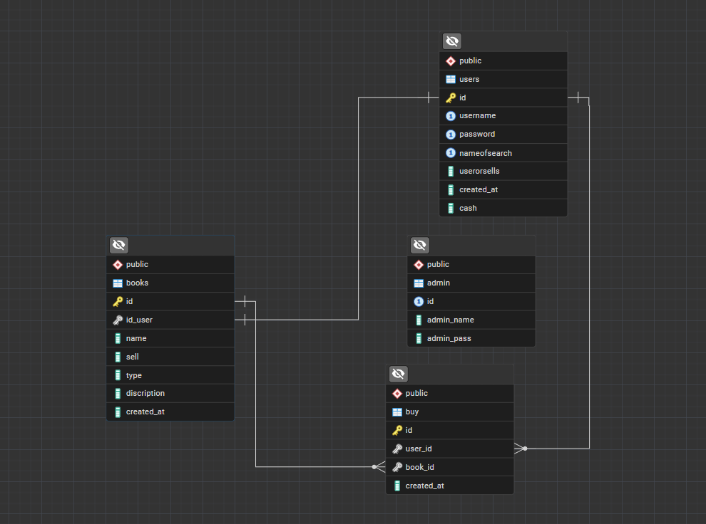

# book_server
### Version_1.0.0
* [SeeStructrue](#structrue)
* [See Digram For Data Base](#diagram)
* [to See all of information](https://agsalem.github.io/Book-App-Back/)
* [See My Portfolio](#myportfolio)
##  PFNB Stack
* Postgres
* Fastify
* Next.js
* Bun
## startup server
```bash
npm run dev
# or
yarn dev
# or
pnpm dev
# or
bun dev
```
## about
### API to create, read, Update, Users ,Buy, Sell, DashBoard For Users, DashBoard For Admin
## Featrue in this Version
* Create
* Read
* Update
* Logout
* DashBoard For Users
* DashBoard For Admin
## structrue

```bash
this is structrue
V_1.0.0
books_server/


|_index.ts
|
|__src/
    |
    |__connection.ts
    |
    |
    |__admin/
    |   |__admin.ts
    |   |__fack.ts
    |
    |
    |controller/
    |     |__books/
    |     |     |__create.ts
    |     |     |__delete.ts
    |     |     |__seeallbooks.ts
    |     |     |__update.ts
    |     |
    |     |__buy/
    |     |    |__create.ts
    |     |    |__updat.ts
    |     |
    |     |__cart/
    |     |   |__buy.book.ts
    |     |   |__return.book.ts
    |     |   |__return.book.ts
    |     |
    |     |__orders/
    |     |    |__create.ts
    |     |    |__seeAllorders.ts
    |     |
    |     |__users/
    |     |   |__authuser.ts
    |     |   |__cash.ts
    |     |   |__create.ts
    |     |   |__dashboard.user.ts
    |     |   |__Login.ts
    |     |   |__logout.ts
    |     |   |__setting.ts
    |     |   |__update.ts
    |     |
    |     |__search/
    |
    |db/
    | |__db.ts
    |
    |plugin/
    |  |
    |  |_multer.ts
    |  |
    |  |_limit.ts
    |
    |routes/
    |  |____admin.ts
    |  |
    |  |____books.ts
    |  |
    |  |____search.ts
    |  |
    |  |____users.ts
    |  |
    |  |____welcom.ts
    |
    |common/
        |__err.ts
        |__sql.ts
```
## diagram


## myportfolio
[portfolio](https://agsalem.github.io/portfolio)

provided by Ahmed Gamal @2026